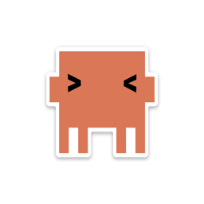
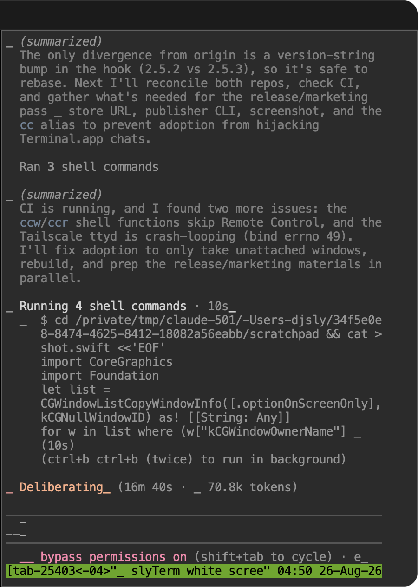

<p align="center">
  
</p>

<h1 align="center">slyTerm</h1>

<p align="center">
  <strong>The Claude Code terminal for macOS.</strong><br>
  Every tab is a Claude Code chat. Close the lid, restart, relaunch — the chats are still there.<br>
  Read and answer them from your Apple Watch.
</p>

<p align="center">
  <a href="https://github.com/AssiamahS/slyTerm/releases/latest"></a>
  
  
  
  <a href="https://sylvassiamah.gumroad.com/l/slyterm"></a>
</p>

<p align="center">
  
</p>

## Why

I run five or six Claude Code sessions at once, all day. Terminal.app loses them on a
restart, a browser tab loses them on sleep, and none of them tell my watch anything.
slyTerm is the ~900-line Swift app I built to fix that. It is not a general terminal
emulator — it is a **session manager for Claude Code** that happens to render a
terminal.

## What you get

- **A tab is a chat.** Each tab opens Claude Code with `--remote-control` already on,
  so the same conversation is on your phone in the Claude app before you type a word.
- **Chats outlive the app.** Every tab is a window in a shared tmux group. Sleep, wake,
  quit, crash, `killall slyTerm` — relaunch and the tabs come back attached to the
  exact same conversations. Nothing is re-spawned.
- **Self-healing.** The web terminal never goes white: the backend is retried until it
  is up, a dead websocket is re-attached in 3 seconds, a killed WebKit process reloads.
- **Apple Watch mirror.** With [ccwatch](https://github.com/AssiamahS/ccwatch) the watch
  lists exactly the tabs on your Mac — same order, same names, live busy/idle dots —
  and a dictated reply is typed straight into that tab.
- **Chat-aware drag & drop.** Drop a file, a Finder selection, or a macOS screenshot
  thumbnail into a tab and the path is pasted into the prompt.
- **Splits.** Up to four chats per window, unlimited windows.
- **Native.** Swift + WebKit, single ~230 KB binary. No Electron, no Node, no Chrome.

## Install

```bash
brew install ttyd tmux
git clone https://github.com/AssiamahS/slyTerm.git && cd slyTerm
./install.sh          # builds, installs to /Applications, sets up the ttyd LaunchAgent
```

Prefer a prebuilt DMG plus the exact shell/launchd kit I run, with the watch daemon and
a written setup guide? That's the
**[$12 kit on Gumroad](https://sylvassiamah.gumroad.com/l/slyterm)** — it's the same
source, packaged, and it is how this project gets funded.

## How it works

```
slyTerm tab (WKWebView) ──▶ ttyd :7681 ?arg=sly-104233 ──▶ slyterm-shell
                                                              │
                              tmux group "slywatch" ◀─────────┘ attach-or-create window
                              │ one window per chat
                              ├─ sly-104233  claude --remote-control   ◀── tab 1
                              ├─ sly-104501  claude --remote-control   ◀── tab 2
                              └─ home        (sleeper)
                                     ▲
                        ccwatchd reads the same group ──▶ Apple Watch
```

The tab owns a window *name*, not a process. Reload the tab and `slyterm-shell` finds
the window and re-attaches. A 3-second supervisor in the app compares its tabs with
`tmux list-windows`: a window with no client gets reattached, a window nobody owns
becomes a new tab (that's how a chat you start from the watch appears on the Mac), and a
tab whose window is gone closes itself. Cmd+W kills the window, so the watch and the
desktop always agree.

## Keyboard

| Shortcut | Action |
|----------|--------|
| `Cmd+N` | New window (new chat) |
| `Cmd+T` | New split in this window (new chat) |
| `Cmd+W` | Close split / window — ends that chat |
| `Cmd+V` | Paste (reads the system pasteboard, so cross-app paste always works) |
| `Ctrl+Cmd+F` | Full screen |

## Requirements

macOS 14+, Apple Silicon, `ttyd` 1.7+, `tmux` 3+, Claude Code CLI.

## Changelog

**2.6.0** — fixed the close-window crash (`isReleasedWhenClosed`), retry the backend
at login instead of a white screen, tabs bound to tmux windows (survive sleep/relaunch),
orphan adoption, watch 1:1. **2.5** — file-promise and image drops. **2.4** — raw image
drops. **2.3** — pasteboard-backed Cmd+V.

## License

MIT. If it saves you a restart, [buy the kit](https://sylvassiamah.gumroad.com/l/slyterm).
